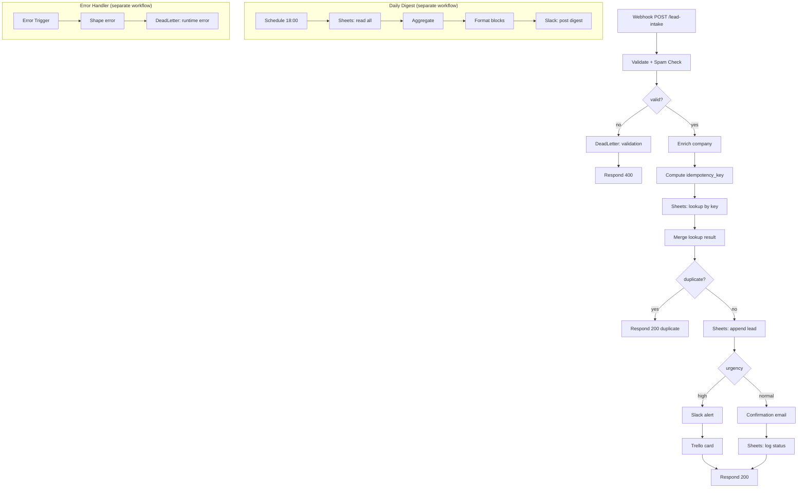

# opscopilot — Task 2 · Lead-to-Support Automation (n8n)

An n8n automation that turns inbound leads (via webhook) into a structured
support pipeline: **validate → spam-check → enrich → idempotent store →
urgency-based routing → daily digest**, with retries, failure logging, and a
dead-letter path.

- **High-urgency leads** → Slack alert + Trello card
- **Normal leads** → confirmation email + status logged in Google Sheets
- **Invalid / spam leads** → dead-letter sheet + `400` response
- **Runtime failures** → dead-letter sheet via a global error workflow
- **Daily at 18:00** → Slack digest (counts by urgency, by product, top-5 recent)
- **Idempotent** → replaying the same payload N times stores exactly one record

---

## Architecture



Three workflows in `workflows/`:
| File | What |
|---|---|
| `lead-to-support.json` | The main intake → route pipeline (18 nodes) |
| `daily-digest.json` | Cron 18:00 → aggregate → Slack digest |
| `error-handler.json` | Global Error Trigger → dead-letter sheet |

---

## Prerequisites

- [Docker Desktop](https://www.docker.com/products/docker-desktop/) (for local n8n)
- A Google account (Sheets)
- A Slack workspace (incoming webhook)
- A Trello account (API key + token)
- An SMTP account (Gmail app password works)

> No credit card needed for any of these — all free tiers.

---

## Setup

### 1. Start n8n

```bash
cd task2-n8n-workflow
cp .env.example .env          # fill in after the steps below
docker compose up -d
```

Open **http://localhost:5678** and create the owner account (local only).

### 2. Google Sheets

1. Create a new Google Sheet named **`opscopilot-leads`**.
2. Create two tabs with these exact headers in row 1:

   **`Leads`** tab:
   ```
   idempotency_key | received_at | name | email | company | company_source | product | urgency | message | status
   ```

   **`DeadLetter`** tab:
   ```
   received_at | name | email | company | product | urgency | message | error_reason | stage
   ```
3. Copy the **document ID** from the URL
   (`https://docs.google.com/spreadsheets/d/`**`THIS_PART`**`/edit`) into `.env` as `SHEETS_DOC_ID`.
4. In n8n: **Credentials → New → Google Sheets OAuth2 API**. Follow n8n's
   [Google OAuth guide](https://docs.n8n.io/integrations/builtin/credentials/google/oauth-single-service/);
   name the credential **`Google Sheets account`** (the workflow references it by that name).

### 3. Slack

1. Create an [incoming webhook](https://api.slack.com/messaging/webhooks) for your target channel (e.g. `#leads`).
2. Paste the webhook URL (`https://hooks.slack.com/services/...`) into `.env` as `SLACK_WEBHOOK_URL`.

   > Slack alerts + the digest are sent via a plain **HTTP Request** node posting `{ "text": ... }` to this webhook. No n8n Slack credential needed — this is version-independent and the simplest possible setup.

### 4. Trello

1. Get your API key + token from https://trello.com/app-key.
2. Create a board (e.g. **`Support Pipeline`**) with a list (e.g. **`Incoming`**).
3. Find the **list ID**: open the board, append `.json` to the URL, search for your list name — its `id` is the `TRELLO_LIST_ID`. Put it in `.env`.
4. In n8n: **Credentials → New → Trello API**, paste key + token. Name it **`Trello account`**.

### 5. SMTP (confirmation email)

1. For Gmail: enable 2FA, then create an [app password](https://myaccount.google.com/apppasswords).
2. In n8n: **Credentials → New → SMTP**:
   - Host `smtp.gmail.com`, Port `465`, SSL on
   - User = your Gmail, Password = the app password
   - Name it **`SMTP account`**
3. Set `SMTP_FROM_EMAIL` in `.env` to your from-address.

### 6. Import the workflows

In n8n: **Workflows → Import from File**, import all three from `workflows/`.
After importing, open each node that shows a credential warning and pick the
matching credential you created above. (Names line up, so this is one click each.)

Then restart n8n so it picks up the `.env` values:
```bash
docker compose down && docker compose up -d
```

### 7. Activate

- Activate **`opscopilot — Lead to Support`** (toggle top-right). Copy the
  **Production URL** of the Webhook node — it looks like
  `http://localhost:5678/webhook/lead-intake`.
- Activate **`opscopilot — Daily Lead Digest (6 PM)`**.
- The error handler is wired automatically: the main workflow's
  `settings.errorWorkflow` points to `opscopilot-error-handler`. (If your n8n
  matches error workflows by name, no extra step; otherwise set it via
  **Workflow → Settings → Error Workflow**.)

---

## Run the samples

There are helper scripts (default URL `http://localhost:5678/webhook/lead-intake`,
override with `WEBHOOK_URL`):

**Windows / PowerShell**
```powershell
.\send-payload.ps1 -File sample-payloads\01-valid-high-acme.json
.\send-payload.ps1 -File sample-payloads\02-valid-normal-gmail.json
```

**macOS / Linux**
```bash
./send-payload.sh sample-payloads/01-valid-high-acme.json
./send-payload.sh sample-payloads/02-valid-normal-gmail.json
```

| Payload | Expected result |
|---|---|
| `01-valid-high-acme` | Slack alert + Trello card; row in `Leads`; `200 accepted` |
| `02-valid-normal-gmail` | Confirmation email; row in `Leads` (company → `(individual)`); `200 accepted` |
| `03-valid-normal-infer-company` | Company inferred as `Brightwave` from email domain |
| `04-valid-high-no-company` | High path; company inferred `Fintech-labs` |
| `05-invalid-missing-fields` | `400 rejected`; row in `DeadLetter` (missing email+message) |
| `06-invalid-malformed-email` | `400 rejected`; dead-letter (malformed email) |
| `07-invalid-spam-keywords` | `400 rejected`; dead-letter (spam keywords + links) |
| `08-invalid-suspicious-tld` | `400 rejected`; dead-letter (`.ru` TLD) |
| `09-idempotency-replay` | See idempotency demo below |
| `10-valid-normal-enterprise` | Normal path; feeds the digest |

### Idempotency demo (replay 3×, store once)

```powershell
.\send-payload.ps1 -File sample-payloads\09-idempotency-replay.json -Repeat 3
```
```bash
./send-payload.sh sample-payloads/09-idempotency-replay.json 3
```

- **Request 1** → `200 accepted`, one new row in `Leads`.
- **Requests 2 & 3** → `200 duplicate` with the same `idempotency_key`, **no new rows**.

The key is `sha256(lower(email) | product | UTC-date)[:32]`, computed in the
*Compute Idempotency Key* node. Before appending, *Sheets: Read All Leads* +
*Check Duplicate* scan for an existing row with that key; *IF: Duplicate?*
short-circuits to a duplicate response. Result: replays within the same day
collapse to a single stored record.

> Note: the duplicate check + append are not a single atomic transaction, so 3
> *simultaneous* replays could theoretically race. The sample scripts send
> requests sequentially (the documented demo), which is the realistic
> webhook-retry pattern and stores exactly one row.

### Dead-letter / failure demo

- Send any `05`–`08` payload → it lands in the **`DeadLetter`** tab with an
  `error_reason` and `stage=validation`, and the caller gets `400`.
- For runtime failures (e.g. revoke the Sheets credential briefly), the global
  **error-handler** workflow catches the execution error and writes a row with
  `stage=runtime-error`.

### Daily digest

- Runs automatically at **18:00** (`GENERIC_TIMEZONE=Asia/Kolkata` in compose).
- To demo on-demand: open the digest workflow and click **Execute Workflow** —
  it reads the `Leads` tab, aggregates today's leads, and posts the Slack digest.

---

## Reliability Requirements — how each is met

| Requirement | Implementation |
|---|---|
| **Idempotency** | Deterministic `idempotency_key` + pre-insert lookup + duplicate short-circuit. Proven by replaying payload `09` three times → one row. |
| **Retries** | Sheets/Slack/Trello/SMTP nodes set `retryOnFail: true`, `maxTries: 3`, with backoff on the append. |
| **Failure logging** | Validation failures → `DeadLetter` (stage `validation`). Runtime errors → `DeadLetter` (stage `runtime-error`) via the Error Trigger workflow. |
| **Dead-letter path** | Dedicated `DeadLetter` sheet tab capturing the payload + `error_reason`, separate from the `Leads` table. |

---

## Configuration reference

Env vars (in `.env`, surfaced to workflows as `$env.*`):

| Var | Used by | Example |
|---|---|---|
| `SHEETS_DOC_ID` | all Sheets nodes | `1A2b3C...` |
| `TRELLO_LIST_ID` | Trello card node | `665f...` |
| `SMTP_FROM_EMAIL` | confirmation email | `support@yourdomain.com` |
| `SLACK_WEBHOOK_URL` | Slack alert + digest | `https://hooks.slack.com/services/...` |

Credential names the workflows expect (create these in n8n):
`Google Sheets account`, `Trello account`, `SMTP account`.
(Slack uses the `SLACK_WEBHOOK_URL` env var via an HTTP Request node — no n8n credential needed.)

---

## Screenshots

Required evidence lives in [`screenshots/`](screenshots/) — see its README for
exactly what to capture: high-urgency path, normal path, dead-letter path, and a
daily-digest execution.
