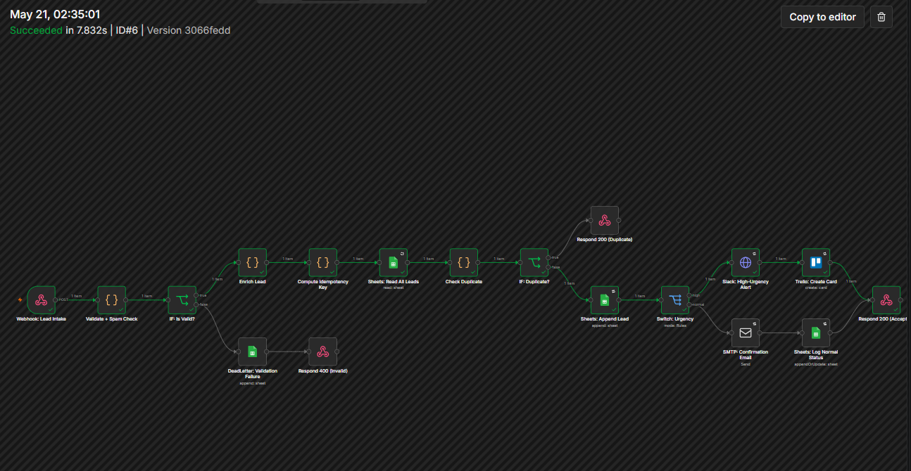
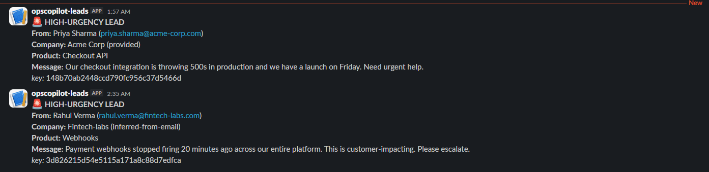
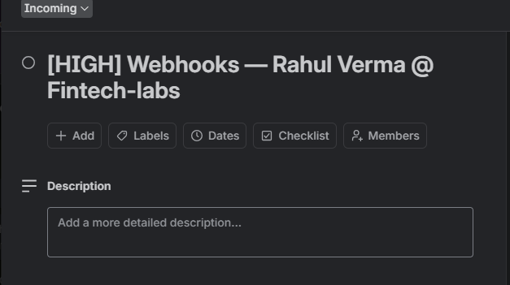
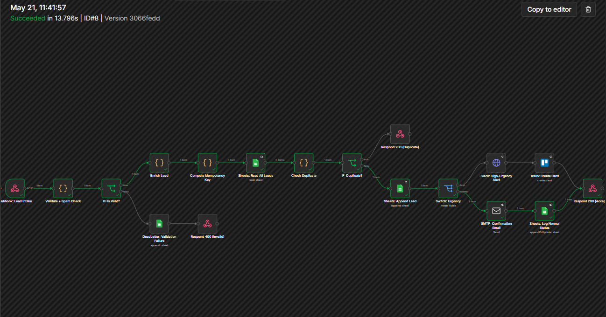
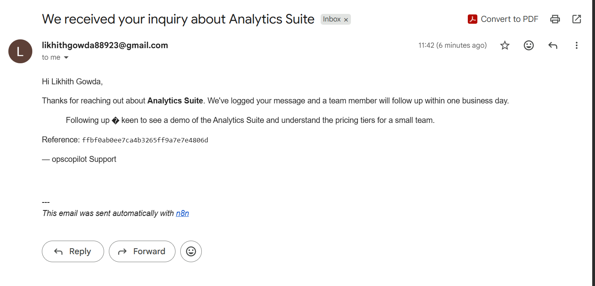
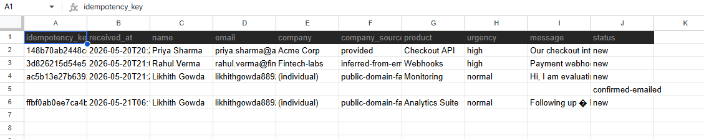
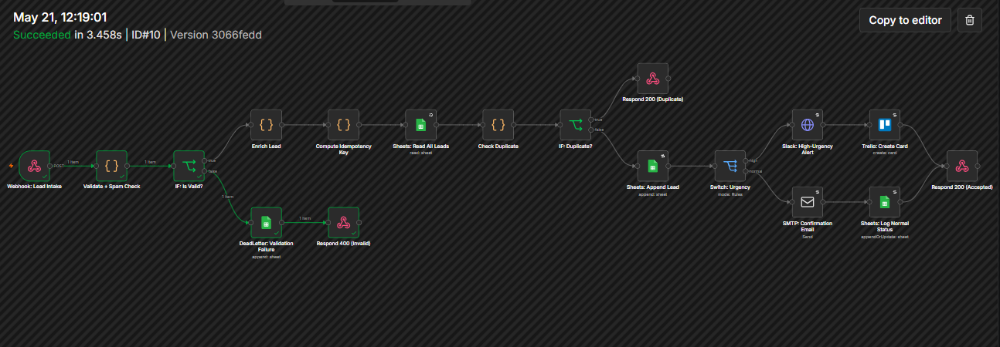
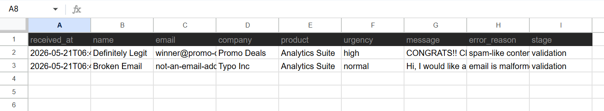
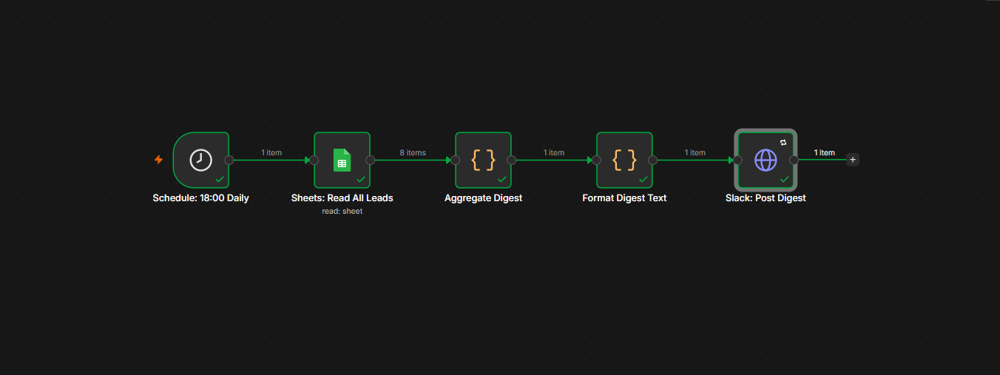
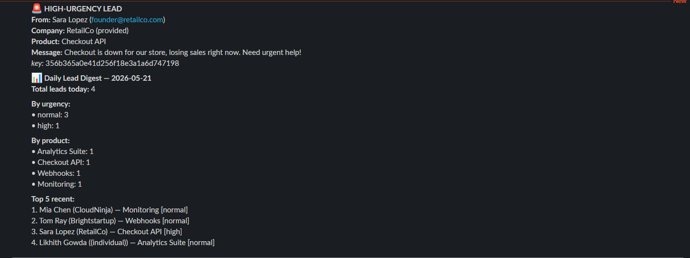

# Screenshots — Evidence of the Live Pipeline

All four required flows captured from a live run (local n8n + Google Sheets +
Slack + Trello + Gmail SMTP). Each path shows the n8n execution **plus** the
real side-effect it produced.

---

## 1. High-urgency path → Slack alert + Trello card

The lead is validated, enriched, stored, and routed to the **high-urgency**
branch, which posts a Slack alert and creates a Trello card.

**Execution (all green):**

**Slack alert:**

**Trello card created (name + company auto-filled):**

---

## 2. Normal path → confirmation email + status logged

A normal-urgency lead routes to the **normal** branch: a confirmation email is
sent and the lead's status is logged in the `Leads` sheet.

**Execution (normal branch green):**

**Confirmation email received:**

**Lead row in the `Leads` sheet:**

---

## 3. Dead-letter path → validation failure logged

Spam / malformed leads are rejected with a `400` and written to the dedicated
`DeadLetter` sheet tab with the failure reason — separate from the `Leads` table.

**Execution (IF → DeadLetter → Respond 400):**

**DeadLetter sheet (rejected leads with `error_reason`):**

---

## 4. Daily digest → Slack summary

The scheduled digest (18:00 daily, also runnable on demand) reads the day's
leads and posts a Slack summary: counts by urgency, by product, and the top-5
most recent.

**Digest execution (all green):**

**Slack digest message:**

---

## How each was produced

| # | Path | Trigger |
|---|------|---------|
| 1 | High-urgency | `POST` a `"urgency":"high"` payload → Slack + Trello |
| 2 | Normal | `POST` a `"urgency":"normal"` payload → email + sheet log |
| 3 | Dead-letter | `POST` a spam / malformed payload (e.g. `sample-payloads/07-invalid-spam-keywords.json`) → `400` + DeadLetter row |
| 4 | Daily digest | Open `daily-digest.json` → **Execute Workflow** → Slack summary |

Idempotency is also demonstrable: replaying the same payload returns
`{"status":"duplicate"}` and stores only one row (see the README's idempotency
section).
